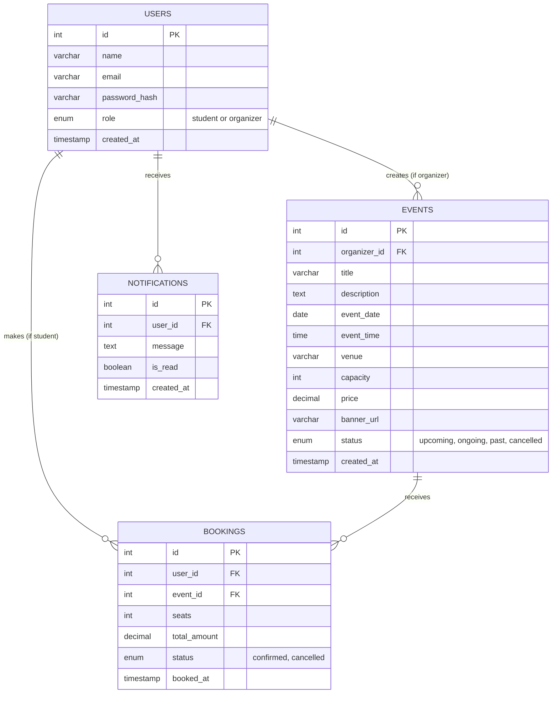

# Event Booking System - Database Schema (ER Diagram)

You can copy and paste the text block below into any Markdown viewer that supports Mermaid (like GitHub), or paste it into [Mermaid Live Editor](https://mermaid.live/) to instantly generate an image of your Database Schema for your project report!

